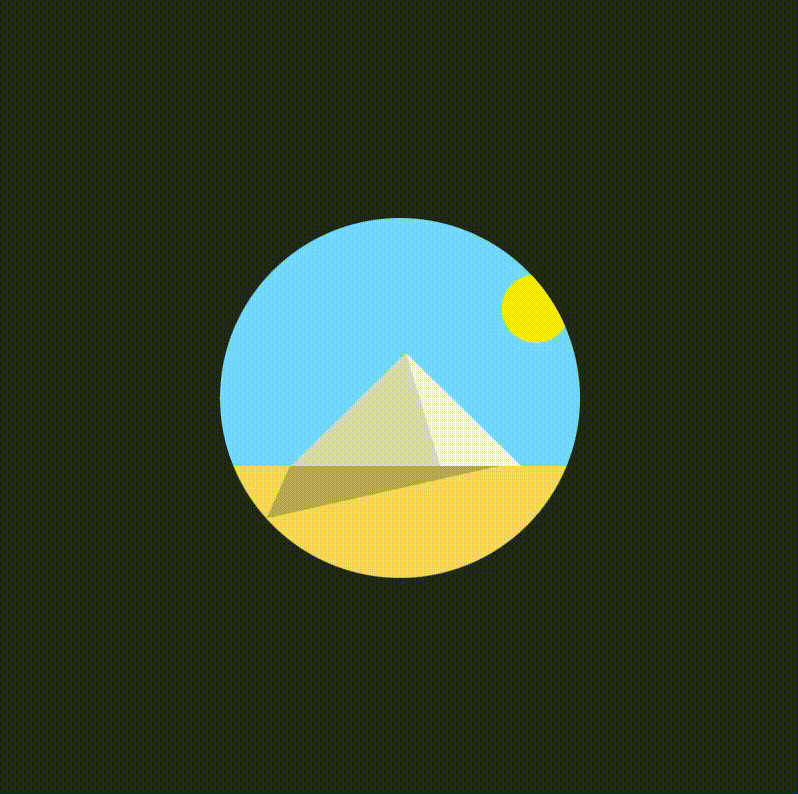

### Menu animado

Neste exercício uma simples animação, mas com muitos aprendizados. 

Dentre elas a propriedade transform-origin que altera os eixos de um elemento. Utilizando-o juntamente com o a propiedade de rotação do objeto, foi possível fazer a animação do sol.

Outro recurso do CSS utilizado foi o clip-path. Com ele é possível criar formas geométricas e aplicar a um elemento, sendo que apenas o que está coberto pela forma geométrica é exibido em tela. Com isso foi possível formar a pirâmide e sua sombra.

Também utilizei a função scaleY(), a qual possibilitou aumentar e diminuir o tamanho da sombra.

##Tecnologias
* HTML
* CSS

## Preview
